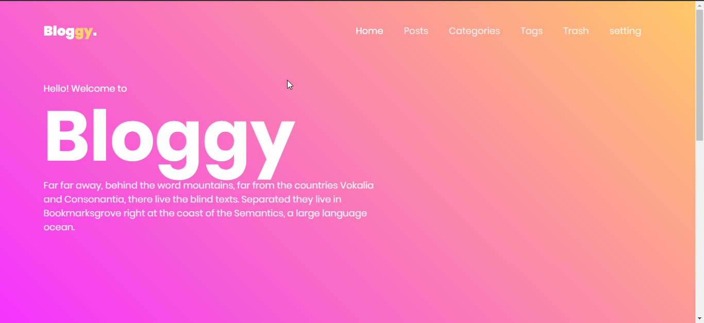
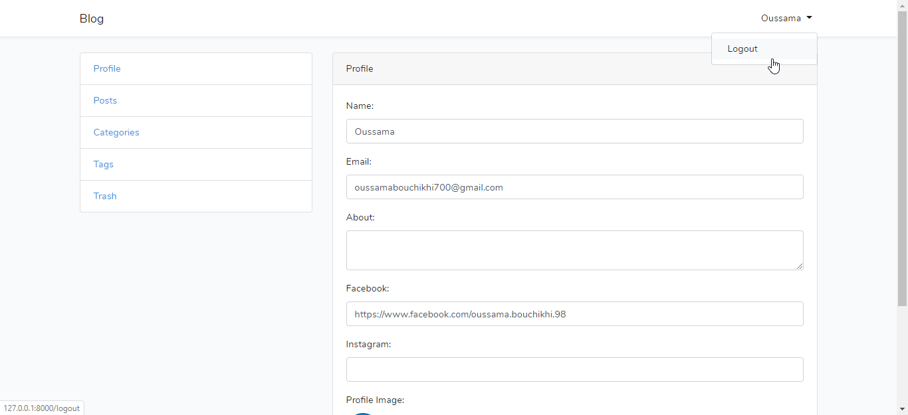

# Bloggy
A blog made with laravel where users can create, edit & share their posts.

## Features
    - Authentication (Login, logout, register, reset password)
    - Move to trash, delete or restore posts
    - CRUD(Create Read Update Delete) for Categories, posts, tags
    - Admin dashboard (users stats)

## Screenshot
<p align="center">
    
    
</p>

## Tools & Languages
- **[Laravel](https://laravel.com/)**
- [VSCode](https://code.visualstudio.com/).

## Todo
    - Improve "/home" page design
    - Fix editor issue (Html tags are rendered instead of text)
    - Fix Image issue

## Contributing

Pull requests are welcome feel free fo ```fork``` this repo.

## License

This project is open-sourced under the [MIT license](https://opensource.org/licenses/MIT).
